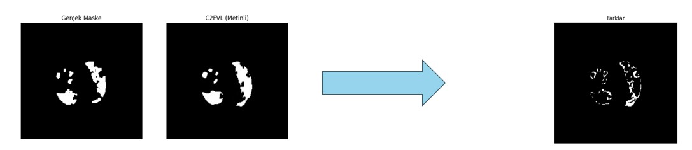
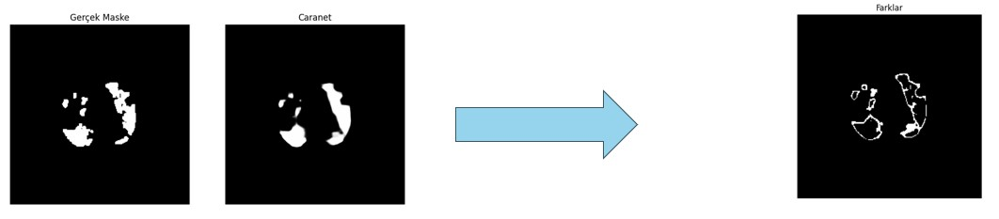
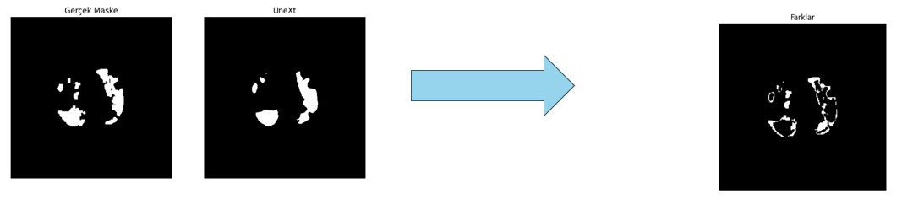

# Medical Image Segmentation Models

This repository presents a comparative study involving a model employing the Vision-Language approach for medical image interpretation and several other trained models. The primary focus is on assessing the effectiveness of the Vision-Language model in this context.

## Data

The open-source MosMedData+ dataset was utilized for training and evaluating the models in this repository.

## Model Comparison

The models trained and evaluated in this project are as follows:

1. **Model 1: Coarse-to-Fine Covid-19 Segmentation via Vision-Language Alignment (C2FVL)**
   - **Description:** This model operates through the Vision-Language approach, combining textual descriptions containing information about lesion counts and specific locations in the image. Notably, the model is retrained without textual descriptions, emphasizing the significance of incorporating textual information [34].
   - **Text:** ✔

2. **Model 2: Context Axial Reverse Attention Network for Segmentation of Small Medical Objects (CaraNet)**
   - **Description:** CaraNet implements a novel attention-based network for segmenting small medical objects such as polyps and brain tumors. It combines Convolutional Neural Network and Transformer structures in a hybrid architecture [35].
   - **Text:** ✗
3. **Model 3: MLP-based Rapid Medical Image Segmentation Network (UNeXt)**
   - **Description:** UNeXt is an MLP-based network designed for rapid and successful image segmentation. In contrast to the complexity and slowness of recent studies, UNeXt employs a Convolutional Multi-Layer Perceptron (MLP) for efficient results [36].
   - **Text:** ✗
     
## Results

The results presented below are based on the evaluation of each model using the MosMedData+ dataset:

| Model | Accuracy | Precision| Recall | IOU Score | Dice Score |
|-------|-----------|--------|----------|-----------|------------|
| C2FVL | 0.988     | 0.989   | 0.988    | 0.581     | 0.716       |
| CaraNet |0.999 | 	0.886	| 0.661| 	0.589	| 0.723
| UNeXt | 0.990|	0.733	|0.793|	0.616|	0.760 |

### Output Images

#### Model 1: Coarse-to-Fine Covid-19 Segmentation via Vision-Language Alignment (C2FVL)

#### Model 2: Context Axial Reverse Attention Network for Segmentation of Small Medical Objects (CaraNet)

#### Model 3: MLP-based Rapid Medical Image Segmentation Network (UNeXt)

## Usage

To utilize these models for medical image analysis, follow the instructions provided in each model's respective directory.

## Citation

If you find these models useful for your work, please consider citing the relevant publications associated with each model.

## Model Repositories

- [C2FVL Repository](https://github.com/HUANGLIZI/C2FVL)
- [CaraNet Repository](https://github.com/AngeLouCN/CaraNet)
- [UNeXt Repository](https://github.com/jeya-maria-jose/UNeXt-pytorch)
